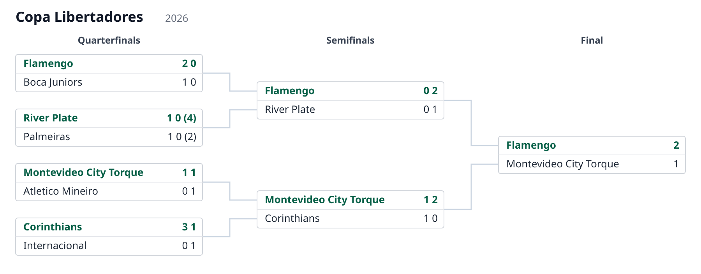
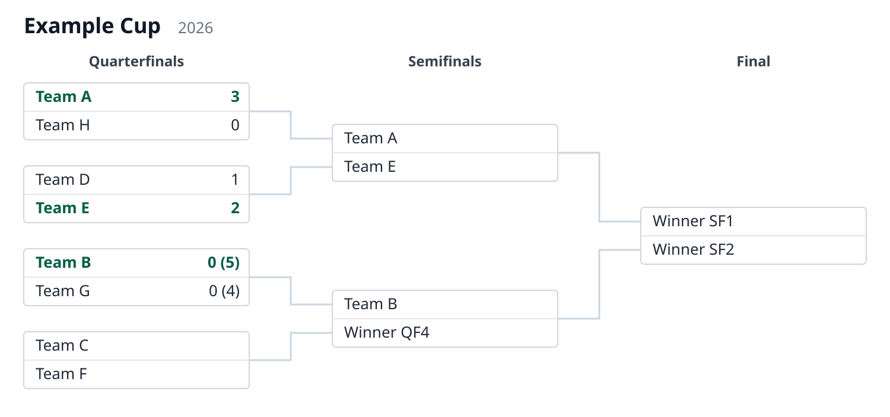

# matamata

[](https://github.com/anibalpacheco/matamata/actions/workflows/ci.yml)
[](LICENSE)

Model a **tournament knockout stage** in a small **JSON "language"** and render
the schedule in **SVG** or **HTML table** format.

**matamata** also lets a host system map documents representing championship
knockout stages onto its own business objects (e.g. a Championship or Cup entity) and persist
them apart from any presentation concern — updating results means editing a document,
never the code.

Example rendered from
[`examples/libertadores-2026.json`](examples/libertadores-2026.json):



## Quickstart

Requires Python ≥ 3.10. No runtime dependencies.

```bash
git clone https://github.com/anibalpacheco/matamata.git
cd matamata
python -m venv .venv && source .venv/bin/activate
pip install -e .
```

Render a self-contained example to an SVG file:

```bash
# via the installed command
matamata examples/knockout-8.json -o knockout.svg

# or via the module, writing to stdout
python -m matamata examples/knockout-8.json > knockout.svg

# or as an HTML table, the layout for small screens
matamata examples/knockout-8.json -o knockout.html
```

Open the resulting file in a browser to view the schedule. To render your own cup,
point the command at any JSON file that follows [`docs/format.md`](docs/format.md).

Use it from Python:

```python
from matamata import load_stage, render_svg

svg = render_svg(load_stage("examples/knockout-8.json"))
```

To use it in your own project instead, install straight from GitHub:

```bash
pip install git+https://github.com/anibalpacheco/matamata.git
```

## Examples

Both examples are rendered from the JSON files in [`examples/`](examples/).

The Copa Libertadores example above shows two-legged ties — each leg's goals are
shown, shootouts appear in parentheses, and the winner of each tie is emphasized. The
first quarterfinal is **host-resolved**: its legs carry only a `ref`, so its teams and
scores come from `get_match` (see
[`examples/libertadores_host.py`](examples/libertadores_host.py)) rather than from the
document. Played ties take their team names from the legs; the final is a single match —
one leg, so just one goal figure per side — with its `winnerof` links wiring the
advancement tree.

Single matches ([`knockout-8.json`](examples/knockout-8.json)) — one goal figure per
side, with shootouts in parentheses. Sides that have not been resolved yet fall back to
placeholders such as "Winner SF2":



## The format

The document is plain JSON, so any system can store and exchange it natively, and the
language is designed so a match can evolve from a **placeholder** (e.g. "winner
of QF1") into a **reference to a real match entity** — each leg can carry a `ref` to
the real game, resolved dynamically by the host — without changing the language. The
advancement tree is laid out **deterministically**: coordinates are
computed directly and the SVG is emitted as a string, with no layout engine and no
heavy dependencies.

See [`docs/format.md`](docs/format.md) for the full specification and
[`docs/schema.json`](docs/schema.json) for the JSON Schema. Worked examples live in
[`examples/`](examples/).

Minimal example:

```json
{
  "tournament": "Copa Libertadores",
  "season": "2026",
  "rounds": [
    {
      "name": "Final",
      "matches": [
        {
          "id": "final",
          "legs": [
            { "team1": "Flamengo", "goals1": 1, "team2": "Nacional", "goals2": 2 }
          ],
          "winner": 2
        }
      ]
    }
  ]
}
```

## Documentation

[docs/index.md](docs/index.md) is the manual: rendering from the CLI and from Python
(e.g. a Django view), feeding live data from your own database through
`KnockoutStage`, updating the stored document with `apply_results` — including a
before/after walkthrough of one call — and running the test suite.

## Status

Working: the language spec, JSON Schema, Python renderer, CLI and tests are in place,
and the package is installable from GitHub.
