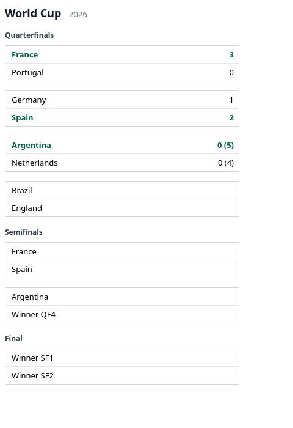
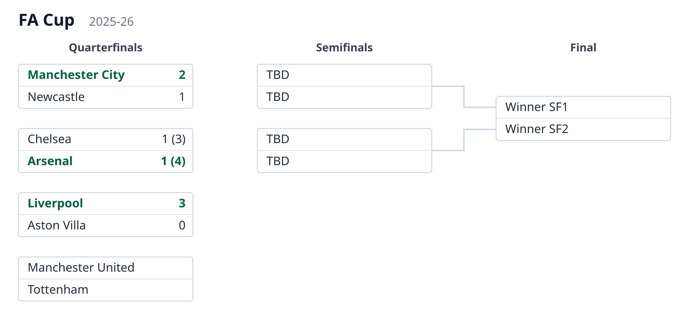
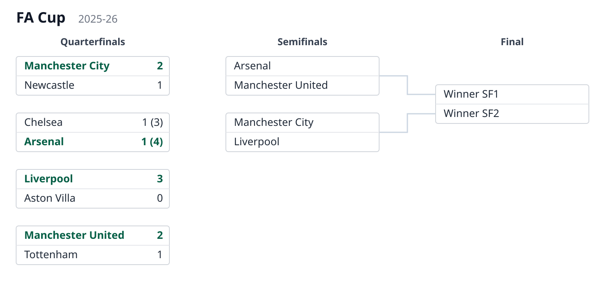

# Documentation

**matamata** is a tool in three parts: the definition of a small JSON language
for describing a tournament knockout stage (written down in [the spec](format.md), with
a machine-checkable [JSON Schema](schema.json)); a Python package that renders a
document in that language into the schedule — SVG or HTML table format —
deterministically and with no dependencies; and
the `KnockoutStage` class, which models the knockout stage itself — the object everything
else is done through.

This manual covers how to put it to work, from a one-off render to a host application
that keeps its knockout stages up to date, and how to run the test suite. Worked examples
live in the repository's `examples/` directory; for a first taste, the README's
quickstart.

## Usage

### Installation

A standard pip-installable package, requiring Python ≥ 3.10 and no runtime
dependencies — install it into your project from PyPI:

```bash
pip install matamata
```

For the latest unreleased commit, install straight from GitHub instead:

```bash
pip install git+https://github.com/anibalpacheco/matamata.git
```

To follow along with the worked examples below, use a source checkout instead:

```bash
git clone https://github.com/anibalpacheco/matamata.git
cd matamata
python -m venv .venv && source .venv/bin/activate
pip install -e .
```

### Rendering from the command line

The package installs a `matamata` command (also runnable as
`python -m matamata`). Point it at a [knockout stage document](format.md) to render
the schedule, to a file with `-o` or to stdout. The format is `-f svg` (the default,
the diagram) or `-f html` (the [table layout](#the-html-table-layout)); an `-o` ending
in `.html`/`.htm` implies `-f html`. For example, to render one of the repository's
worked examples, each way:

```bash
# via the installed command
matamata examples/knockout-8.json -o knockout.svg

# or via the module, writing to stdout
python -m matamata examples/knockout-8.json > knockout.svg

# the HTML table layout (inferred from the extension)
matamata examples/knockout-8.json -o knockout.html
```

Open the resulting file in a browser to view the schedule.

### Rendering from Python

```python
from matamata import load_stage, render_html, render_svg

svg = render_svg(load_stage("examples/knockout-8.json"))
html = render_html(load_stage("examples/knockout-8.json"))
```

`parse_stage` does the same from an already-loaded dict. In a web app the SVG is the
response body — e.g. a Django view:

```python
from django.http import HttpResponse
from matamata import parse_stage, render_svg

def knockout_stage_svg(request, championship):
    svg = render_svg(parse_stage(championship.knockout_stage_json))
    return HttpResponse(svg, content_type="image/svg+xml")
```

### The HTML table layout

On a phone the wide, tree-shaped SVG diagram needs panning; the HTML table layout is
the alternative for small screens. Rounds stack vertically as one table each, every
match is a group of two rows (top side, then bottom side), and advancement is read
top-down — no connector lines. Everything shown follows the same rules as the SVG:
explicit `winner` emphasis, per-leg scores with the shootout in parentheses,
placeholders for unresolved sides.



The output is a self-contained `<div>` fragment, ready to drop into a page. Styling
is driven by `pd-*` CSS classes with embedded defaults, so the host page can theme it.
The document's `render` options are SVG geometry knobs (`box_width`,
`max_label_chars`) and are ignored here — HTML handles long names natively.

### Light and dark mode

Both outputs adapt to the reader's color scheme automatically. The embedded default
styles carry a `@media (prefers-color-scheme: dark)` block, so the same SVG diagram and
HTML table switch to a dark palette wherever the renderer follows the OS/browser setting
— no flag, no API, nothing to pass:


There is nothing to opt into: dark colors apply when the viewing context is dark and the
light palette otherwise (the [HTML table](#the-html-table-layout) above is the same
schedule in light mode). The switch happens in a browser rendering context; a static
rasterizer such as `rsvg-convert` — which produces the other PNG previews in this manual
— ignores the media query and always renders light, so force-rendering a fixed scheme
for static output may come later, alongside full style overrides.

## The `KnockoutStage` class

The operation helpers live on one class, `KnockoutStage`: subclass it to resolve
match references against your own data, and call its `apply_results` to write incoming
results onto the stored document.

### Dynamic and live data integration

The renderer never computes results: the winner of a match is its explicit `winner`
field, and an advancing team is whatever `team1`/`team2` the document records on a match.
To feed live data from your own database instead of (or on top of) the JSON, subclass
`KnockoutStage`. Whenever a leg carries a `ref`, `get_match(ref)` is called with it; you
return that one game as a flat dict, local first (`team1`/`goals1`, `team2`/`goals2`). The
tournament name and season can also be supplied dynamically:

```python
from matamata import KnockoutStage

class ChampionshipDiagram(KnockoutStage):
    def __init__(self, championship):
        super().__init__(championship.knockout_stage_json)
        self._championship = championship

    def get_match(self, ref):
        g = Match.objects.get(pk=ref)            # your own model
        return {
            "team1": g.home.name, "goals1": g.home_goals, "pen1": g.home_pens,
            "team2": g.away.name, "goals2": g.away_goals, "pen2": g.away_pens,
        }

    def get_tournament(self):
        return self._championship.name

    def get_season(self):
        return str(self._championship.year)

def knockout_stage_svg(request, championship):
    svg = ChampionshipDiagram(championship).render()
    return HttpResponse(svg, content_type="image/svg+xml")
```

`render()` returns the SVG diagram; `render("html")` the
[HTML table layout](#the-html-table-layout), hydrated from the same hooks.

`get_match` returns only what it has — any of `team1`/`goals1`/`pen1` and their `2`
counterparts; a returned `None` leaves that leg as the document defines it. Where a side
has no team yet, the resolved name is filled in from the live game while the
advancement connector (`winnerof1`/`winnerof2`) is kept.

The document's display preferences are available to the hooks as `self.render_config`,
so `get_match` can, for instance, read `self.render_config.max_label_chars` and return
already-shortened names. Long-named cups can raise that limit (it defaults to `22`) in
the document's `render` object.

For a runnable example of this integration, see `examples/libertadores_host.py` —
it resolves the refs of the Copa Libertadores example against a JSON lookup table,
and includes the instructions to run it and watch it work.

### Team crests and flags

A schedule is easier to scan when each side shows the team's crest (clubs) or flag
(national teams) next to its name. Crests exist **only through the `KnockoutStage`
class — the JSON document has no crest surface**: team names repeat through the
rounds as teams advance, a cost paid for quick human editing of the JSON, and image
URLs would add nothing to that editability and a lot of noise against it. So it is
the class that resolves the image from each side's identity, the same way
`get_match` resolves results:

```python
class ChampionshipDiagram(KnockoutStage):
    def get_crest(self, team_id, team_name):
        if team_id is None:
            return None
        return Team.objects.get(pk=team_id).crest_url
```

`get_crest` is called once per side that has an identity — `team_id` is the side's
`id{n}` when the document (or `get_match`) supplies one, `team_name` its team name.
Return a URL, a path or a data URI, or `None` for no image (the base implementation
always returns `None`, so nothing changes for existing hosts). The image appears before
the team name in both outputs — an `<image>` element in the SVG diagram, an `` in
the [HTML table layout](#the-html-table-layout) — and the renderer never fetches or
processes it; rows without one (the unresolved placeholders) keep their layout.

The World Cup example resolves each national team's flag, shown here in both the diagram
and the table:


<small>Flags: public-domain national flags from [Wikimedia
Commons](https://commons.wikimedia.org/), referenced by relative path under
`examples/flags/`.</small>

The runnable host behind it is `examples/world_cup_flags_host.py`: a `KnockoutStage`
whose `get_crest` looks each side's `team_name` up in a sibling `flag_data.json` (a
name → flag-file table). `knockout-8.json` carries no ids, so this one resolves by name
(`PYTHONPATH=../src python world_cup_flags_host.py html` from inside `examples/` prints
the table above).

Club crests work exactly the same — here a short invitational, where each side instead
carries an integer `id{n}` that `get_crest` turns into a crest image:


<small>Crests: public-domain club logos (simple text/shapes) from [Wikimedia
Commons](https://commons.wikimedia.org/), referenced by relative path under
`examples/crests/`.</small>

Its host is `examples/copa_rio_host.py`, looking each side's `id{n}` up in a sibling
`crest_data.json` (a team-id → crest-file table), the same way `libertadores_host.py`
resolves a leg's `ref` through `get_match`. In a real deployment that lookup is a
database query and the value a URL. Resolving by `team_id` rather than the display name
is deliberate: names in the document may differ from the source's titling (accents,
short forms), so an id is the stable key — which is why the id-less flags example above
has to fall back to the name.

Documents rendered without the class (the CLI, `render_svg`) simply show no crests.

### Translating the generated labels

Almost every label in the schedule comes straight from the document — team names, round
names, the tournament — so translating those is just a matter of storing them already
translated. The exception is the handful of labels the renderer *generates* for sides
that have no team yet: `Winner SF1` (an unresolved `winnerof` link) and `TBD` (a side
with neither a team nor a link). Those are what this covers.

Like crests above, it is a hook with no JSON surface: override `get_labels`, which
receives the `language` requested at render time and returns the strings to use (or
`None` to keep the English defaults). The same document can be rendered in several
languages — the language flows from `render` / `build` straight to the hook:

```python
from matamata import KnockoutStage

TRANSLATIONS = {
    "es": {"winner": "Ganador {id}", "tbd": "A definir"},
    "pt": {"winner": "Vencedor {id}", "tbd": "A definir"},
}

class ChampionshipDiagram(KnockoutStage):
    def get_labels(self, language):
        return TRANSLATIONS.get(language)

svg = ChampionshipDiagram(document).render(language="es")
```

`get_labels` returns a dict with either or both of `"winner"` (where `{id}` is replaced
by the referenced match id) and `"tbd"`; a key left out falls back to its English
default, and an unknown `language` — or none — leaves everything in English. Team and
round names are not handled here: they are already whatever the document says.

The host owns the translations, so you can resolve them however suits your app — a literal
dict as above, your existing message catalogs, or `gettext`. Documents rendered without
the class (the CLI, `render_svg`) show the English labels.

### The `apply_results` method

When a game finishes (or while it is being played), write its result onto the document
with `apply_results` and persist what it returns — the structure of the knockout stage never
changes, only the JSON field does:

```python
diagram = KnockoutStage(championship.knockout_stage_json)
championship.knockout_stage_json = diagram.apply_results(
    {"id": "sf1", "leg": 2, "goals1": 0, "goals2": 3}
)
championship.save()
```

Each result addresses one leg, either by `ref` (the leg pointing at that real game) or
by match `id` plus an optional 1-based `leg` number (default 1; missing legs are
created). Scores are tie-oriented — `goals1` belongs to the match's top side — and the
present keys simply overwrite the leg, so a live game can be re-applied as it goes. A
list applies several results at once.

By default every touched match is then *settled*: its `winner` is recomputed from the
aggregate (penalties break a tied one), removed when undecided, and the advancing team
is pushed into the match that consumes it via `winnerof`. Pass `settle=False` to skip
that, or put `"settle": false` on a match to keep it out permanently — the renderer
itself still never computes anything.

#### Before and after, end to end

One call, walked through. The two documents below are real assets, kept in sync by the
library itself: [`apply-before.json`](apply-before.json) is hand-written, and
[`apply-after.json`](apply-after.json) is exactly what `apply_results` returns for it,
generated by the library — never edited by hand.

##### Before

A semifinal stage mid-series. `sf1` has its first leg played (1–0) and the second one
scheduled (`{}`); `sf2` is already settled, so the final knows its bottom side while the
top one still shows the "Winner SF1" placeholder:

```json
{
  "tournament": "Champions League",
  "season": "2025/26",
  "rounds": [
    {
      "name": "Semifinals",
      "matches": [
        {
          "id": "sf1",
          "team1": "Real Madrid",
          "team2": "Barcelona",
          "legs": [
            { "goals1": 1, "goals2": 0 },
            {}
          ]
        },
        {
          "id": "sf2",
          "team1": "Bayern München",
          "team2": "Manchester City",
          "winner": 2,
          "legs": [
            { "goals1": 0, "goals2": 2 },
            { "goals1": 1, "goals2": 1 }
          ]
        }
      ]
    },
    {
      "name": "Final",
      "matches": [
        {
          "id": "f",
          "winnerof1": "sf1",
          "winnerof2": "sf2",
          "team2": "Manchester City"
        }
      ]
    }
  ]
}
```


##### The call

The second leg finishes 1–0 for Barcelona, taking the tie to penalties, which Real Madrid
wins 4–2. That is one result dict — scores are tie-oriented, so `goals1`/`pen1` belong
to the match's top side (Real Madrid) no matter where the game was played:

```python
from matamata import KnockoutStage

diagram = KnockoutStage(document)
updated = diagram.apply_results(
    {"id": "sf1", "leg": 2, "goals1": 0, "goals2": 1, "pen1": 4, "pen2": 2}
)
```

##### After

Three things changed in the document, all from that single call:

1. the second leg of `sf1` now carries the result and the shootout;
2. `sf1` was *settled*: the aggregate is 1–1, the shootout breaks it, so
   `"winner": 1` was written;
3. the winner advanced: the final's side 1 got `"team1": "Real Madrid"`.

```json
{
  "tournament": "Champions League",
  "season": "2025/26",
  "rounds": [
    {
      "name": "Semifinals",
      "matches": [
        {
          "id": "sf1",
          "team1": "Real Madrid",
          "team2": "Barcelona",
          "legs": [
            { "goals1": 1, "goals2": 0 },
            { "goals1": 0, "goals2": 1, "pen1": 4, "pen2": 2 }
          ],
          "winner": 1
        },
        {
          "id": "sf2",
          "team1": "Bayern München",
          "team2": "Manchester City",
          "winner": 2,
          "legs": [
            { "goals1": 0, "goals2": 2 },
            { "goals1": 1, "goals2": 1 }
          ]
        }
      ]
    },
    {
      "name": "Final",
      "matches": [
        {
          "id": "f",
          "winnerof1": "sf1",
          "winnerof2": "sf2",
          "team2": "Manchester City",
          "team1": "Real Madrid"
        }
      ]
    }
  ]
}
```


The host can now persist the new version of the document — the value of `updated` —
and every render from then on shows the new state.

## Modeling special tie features

### A pairing pending a draw

In some cups the next round is not wired beforehand: it is redrawn from the winners
(the FA Cup does this after every round). Until the draw happens there is no
advancement path to declare, and the document models that by simply omitting
`winnerof{n}`: the side renders "TBD" and no connector is drawn.

In `examples/facup-pending-draw.json` the quarterfinals are under way but the
semifinal draw is still pending — both semifinals carry only their `id`:

```json
{ "name": "Semifinals", "matches": [{ "id": "sf1" }, { "id": "sf2" }] }
```

The final is wired normally (`"winnerof1": "sf1"`, `"winnerof2": "sf2"`), because the
final's pairing is never redrawn:



Once the draw is made, whoever maintains the document writes the drawn pairings as
plain `team{n}` names — **not** as `winnerof{n}` links. A link declares a
preestablished advancement path and draws its connector; a redrawn round has no such
path, and connectors following a draw could cross each other arbitrarily.
`examples/facup-drawn.json` is the same stage right after the draw:

```json
{
  "name": "Semifinals",
  "matches": [
    {
      "id": "sf1",
      "team1": "Arsenal",
      "team2": "Manchester United"
    },
    {
      "id": "sf2",
      "team1": "Manchester City",
      "team2": "Liverpool"
    }
  ]
}
```

The semifinals now name their teams but stay unconnected to the quarterfinals, which
is exactly what happened — the draw, not the schedule, decided the pairings:



## Testing

Install the development extras and run the suite:

```bash
pip install -e ".[dev]"
pytest
```

The suite includes golden (snapshot) SVG tests: each example document is rendered and
compared against a versioned reference SVG under `tests/golden/`. This catches visual
regressions without a browser.

To eyeball the renders yourself, the repo ships a small dev tool, `examples/gallery.py`,
that renders **every example** — both the SVG diagram and the HTML table, including the
host-resolved ones with crests and flags — into a single self-contained `file://` page,
`examples/gallery.html` (committed, so you can just open it). Its header shows the command
to regenerate it.
